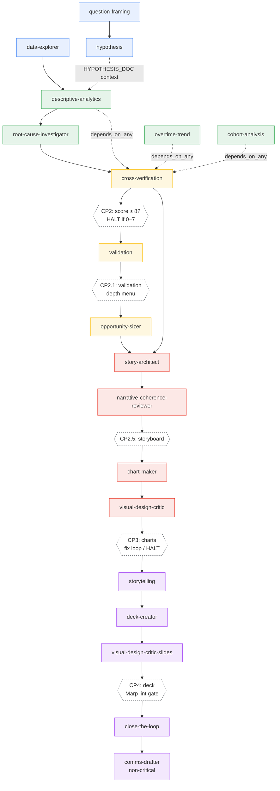
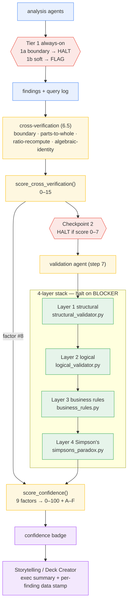
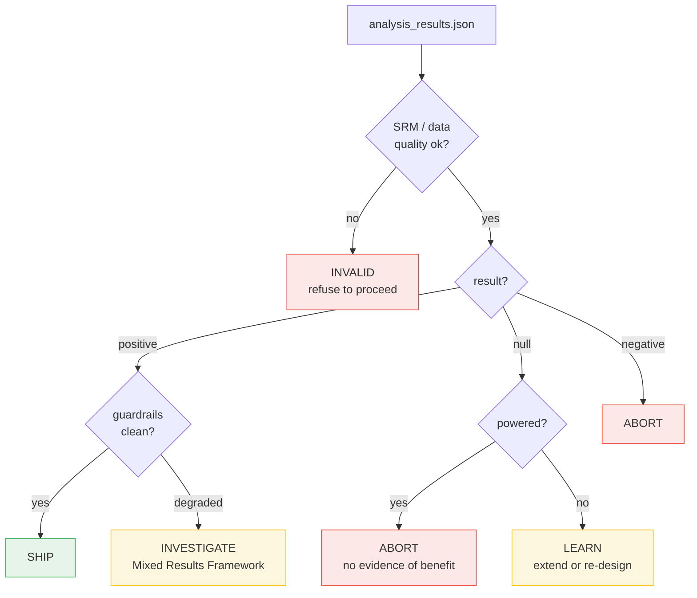

# AI Analyst Plus — Key Workflows & End-to-End Traces

A reference for how the major workflows in this repository are wired, with two
deep traces: how `/run-pipeline` resolves and executes the agent DAG, and how the
4-layer validation stack is wired through `helpers/`.

> Source of truth: `agents/registry.yaml`, `.claude/skills/run-pipeline/skill.md`,
> `.claude/skills/run-pipeline/plans.md`, `agents/validation.md`, and the
> `helpers/*_validator.py` / `helpers/confidence_scoring.py` modules. If those
> files change, this doc is downstream — re-verify before trusting it.

---

## 1. What This Repo Is

AI Analyst Plus turns Claude Code / Codex into a product analytics system. It is
a **Python + agent-prompt** project (not a web app). The moving parts:

| Layer | Location | Nature |
|-------|----------|--------|
| **Skills** | `.claude/skills/` (Claude), `.agents/skills/` (Codex) | Always-active standards — chart style, validation, framing, communication |
| **Agents** | `agents/*.md` | Multi-step prompt templates with `{{VARIABLES}}`, run on demand |
| **DAG registry** | `agents/registry.yaml` | Machine-readable dependency graph that orders agent execution |
| **Helpers** | `helpers/*.py` | Python computation — charting, SQL, validation, experiment stats, export |
| **Knowledge** | `.knowledge/` | Persistent memory — dataset context, corrections, proven SQL, glossary |

**Skills define HOW to do things well; agents DO multi-step work.** Skills fire
automatically on trigger; agents are invoked explicitly (usually by the pipeline).

---

## 2. Key Workflows (Overview)

### 2.1 Main analysis pipeline — `/run-pipeline`
The flagship workflow. 18 agents across 4 phases (Frame → Analyze → Story → Deck),
orchestrated by a DAG engine. Five execution plans let you run just the slice you need:

| Plan | Runs | Use when |
|------|------|----------|
| `full_presentation` (default) | All 18 agents | Business question → validated slide deck |
| `deep_dive` | Phases 1–2 | Analysis, no presentation |
| `quick_chart` | Chart Maker + Design Critic | Just one chart |
| `refresh_deck` | Phases 3–4 (reuses analysis) | Rebuild the presentation layer |
| `validate_only` | Validation only | Re-check existing work |

`/resume-pipeline` recovers an interrupted run from `pipeline_state.json`.

### 2.2 Data connectivity & knowledge
`/connect-data` → `/data` / `/datasets` / `/switch-dataset`. Supports CSV,
DuckDB/MotherDuck, Postgres, BigQuery, Snowflake. Context persists in
`.knowledge/datasets/{id}/` (`manifest.yaml`, `schema.md`, `quirks.md`). Every
query is auto-logged through `ConnectionManager.query()`. Note the local-DuckDB-vs-
live-Snowflake toggle for the `novamart` dataset (`AAP_USE_REMOTE=1`).

### 2.3 Validation & trust
Findings are hypotheses until proven. Five overlapping mechanisms:
- **4-layer validation** — structural → logical → business rules → Simpson's, with an A–F confidence grade (HALT on any BLOCKER). Traced in §4.
- **Cross-verification** — re-derives key numbers via different calculation paths; HALT if score < 8/15.
- **Independent/blind review** — `/independent-review` (provider-neutral) or `/codex-review` dispatch a fresh agent, blind to the numbers, to re-derive results (AGREE/PARTIAL/DISAGREE).
- **`/reliability`** — runs the same question N times to detect STABLE vs DRIFT.
- **Tier 1 always-on** — hard boundary checks (negative revenue, % > 100, future dates) that HALT before any finding is written.

### 2.4 Experimentation & causal inference
`/experiment` (8 modes: design → power → analyze → interpret → report → monitor) and
`/causal` (6 modes: pre-post, DiD, PSM, regression). All calculations go through
`helpers/experiment_stats/` — never inline scipy. SRM check auto-fires on experiment data.

### 2.5 Storytelling, deck & export
Charts follow "Storytelling with Data" (`swd_style()` first, always). Deck workflows:
`/deck-critique`, `/slide-transform`, `/deck-rescue`. Export via `/export` to Marp
PDF/HTML, Google Docs/Slides (MCP), Notion, or local `.docx`.

### 2.6 Analysis design & planning
`/analysis-design` (hunch → hypothesis → confound scan → plan → V1 → V2),
`/stress-test` (7-point methodology review), `/architect` (multi-persona planning),
`/north-star` (metric lifecycle).

### 2.7 Meta / self-improvement
`$skill-parity-review`, `/skill-creator`, `$independent-review`, `$claude-review`,
`$metric-spec` — for authoring and auditing skills across the Claude/Codex boundary.

---

## 3. Trace: How `/run-pipeline` Resolves & Executes the DAG

The pipeline is **not** a hardcoded list of steps. It is a directed acyclic graph
derived at runtime from `agents/registry.yaml`. Here is the full lifecycle.

### 3.0 The registry is the graph
Each agent in `agents/registry.yaml` declares:
- `name`, `file` (path read from disk at execution — rule R8)
- `pipeline_step` (ordering hint; `null` = standalone, excluded from pipeline DAG)
- `depends_on` — **AND-gate**: every listed agent must be `completed`
- `depends_on_any` — **OR-gate**: at least one listed agent must be `completed`
- `critical` (default `true`) — non-critical agents degrade on failure instead of halting
- `inputs`, `outputs`, `knowledge_context`

Example of a mixed gate (`cross-verification`):
```yaml
- name: cross-verification
  pipeline_step: 6.5
  depends_on: [root-cause-investigator]          # AND — must be done
  depends_on_any:                                # OR — any one is enough
    - descriptive-analytics
    - overtime-trend
    - cohort-analysis
```

### 3.1 Step 0 — Crash recovery / pre-execution cleanup
Before anything runs, the engine checks for a stale `working/pipeline_state.json`
with `status: running`. If `updated_at` is > 30 min old → offer to archive and
start fresh (renames to `crashed_{run_id}_state.json`) or redirect to
`/resume-pipeline`. If < 30 min → assume another run is active and HALT. Also
deletes `working/*.tmp.json` partial-write files and removes orphaned
`working/latest` symlinks.

### 3.2 Phase 0 — Pre-flight validation (fail fast on a broken graph)
1. **Read registry** — parse every agent's fields.
2. **File existence** — each `agent.file` must exist on disk, else HALT.
3. **Dependency resolution** — every name in `depends_on`/`depends_on_any` must
   exist in the registry, else HALT (`Unknown dependency`).
4. **Cycle detection** — topological sort via **Kahn's algorithm** (iteratively
   remove in-degree-0 nodes; leftovers form a cycle). HALT on cycle.
5. **Compute execution tiers** — group agents so every agent's dependencies are
   satisfied by *earlier* tiers:
   ```
   Tier 0: no dependencies              → question-framing, data-explorer
   Tier 1: depends only on Tier 0       → hypothesis
   Tier 2: depends on Tier 0–1          → descriptive-analytics
   ...
   ```
6. **Apply execution plan** — load the plan (default `full_presentation`) from
   `plans.md`, filter the DAG to the plan's allow-list, mark the rest `skipped`.
   A plan agent depending on a skipped agent gets a warning, not a halt.

### 3.3 Phase 1 — Run directory & state initialization
Every run is isolated:
```
working/runs/{YYYY-MM-DD}_{DATASET}_{SHORT_TITLE}/
  ├── working/                 # intermediate (storyboards, reviews, tie-outs)
  ├── outputs/                 # deliverables (deck, charts, narrative)
  ├── pipeline_state.json      # authoritative run state (schema_version 2)
  └── pipeline_metrics.json    # timing
working/latest -> {RUN_DIR}    # symlink; legacy working/ & outputs/ maintained too
```
`pipeline_state.json` initializes **all** plan agents to `pending`, skipped agents
to `skipped`, and sets pipeline `status: running`. The query log
(`working/query_log_{dataset}_{date}.jsonl`) is created here and its path becomes
`{{QUERY_LOG}}` for every SQL-touching agent.

**Resume path:** if state already exists with `status: paused|failed`, completed
agents are left alone, failed agents reset to `pending`, and the engine computes the
READY set and jumps to Phase 2.

### 3.4 Phase 2 — Walk the DAG (the execution loop)
```
FOR each tier:
  1. READY_SET = agents whose deps are satisfied:
        ALL depends_on completed (AND)  AND  ≥1 depends_on_any completed (OR, if present)
        (a skipped agent never counts as "completed" for an OR-gate)
  2. If READY_SET empty but pending agents remain → deadlock → HALT
  3. For each ready agent: mark running, stamp started_at, assemble context,
     READ THE AGENT FILE FROM DISK (R8)
  4. LAUNCH: if Task tool available and ≥2 ready → up to 3 parallel Tasks;
     else run sequentially inline
  5. WAIT (5-min timeout per agent, one retry)
  6. On completion: record completed_at + output_files; on failure:
       - critical  → increment tier failure counter
       - non-critical → warn, write a stub output, mark degraded, keep going
  7. CIRCUIT BREAKER: ≥3 critical failures in one tier → HALT
  8. CHECKPOINT (if one fires after this tier)
  9. Update working/pipeline_summary.md
  10. ADVANCE
```

**Dynamic context assembly** before each launch resolves:
- System vars (`{{DATE}}`, `{{DATASET_NAME}}`, `{{ACTIVE_DATASET}}`, …)
- Knowledge context — reads each `knowledge_context` file (with `{active}` substituted)
- Dependency outputs — gathers `output_files` of completed deps as this agent's inputs
- Pipeline args — passes through `context`, `theme`, `audience`, `data_path`

### 3.5 Checkpoints (quality gates between phases)
Checkpoints fire on *which agents completed*, not step numbers:

| Checkpoint | Fires after | Type | Gate |
|-----------|-------------|------|------|
| **1 — Frame** | `hypothesis` | User-facing | Question specific, ≥3 hypotheses across categories |
| **2 — Analysis** | `cross-verification` | Automated | Cross-verify score ≥ 8, no Tier 1a failures, query-log coverage ≥ 80% |
| **2.1 — Validation menu** | `validation` | User-facing | Offer Standard/Deep/Skip depth (with preference learning) |
| **2.5 — Storyboard** | `narrative-coherence-reviewer` | User-facing | Beats form a coherent arc |
| **3 — Story & Charts** | `visual-design-critic` (chart) | Automated | R2/R3/R5/R7 + chart fix loop |
| **4 — Final Deck** | `deck-creator` + slide critic | Automated | R1/R2/R4/R6/R10/R11 + Marp lint gate |

The **chart fix loop** at Checkpoint 3 reads the design critic verdict:
`APPROVED` → skip fixes; `APPROVED WITH FIXES` → run `chart-maker-fixes` (same
file, `FIX_REPORT` injected), re-check once; `NEEDS REVISION` → HALT.

### 3.6 Resilience mechanisms
- **Timeout** — 5 min/agent, one retry; then critical → HALT, non-critical → degrade.
- **Circuit breaker** — 3 critical failures in a tier → HALT (skips don't count).
- **Completion guarantee** — the pipeline MUST emit a deck. If the full DAG can't
  finish, it produces a minimal viable deck from the furthest phase reached, marks
  state `degraded`, and points the user at `/resume-pipeline`.

### 3.7 Post-pipeline
Export deck → PDF + HTML via `helpers/marp_export.py` (non-blocking) → consolidate
artifacts into `{RUN_DIR}` and set `status: completed` → metric capture (detect new
metrics) → archive to `.knowledge/analyses/index.yaml`.

### 3.8 Worked example — `full_presentation` tier resolution
Given the plan allow-list and registry edges, the engine resolves roughly:
```
Tier 0 (parallel): question-framing, data-explorer
Tier 1:            hypothesis            (depends_on question-framing)
Tier 2:            descriptive-analytics (depends_on data-explorer)
Tier 3:            root-cause-investigator (depends_on descriptive-analytics)
Tier 4:            cross-verification    (AND root-cause + OR any analysis agent)   → CP2
Tier 5:            validation            (depends_on cross-verification)            → CP2.1
Tier 6:            opportunity-sizer     (depends_on validation)
Tier 7:            story-architect       (depends_on opportunity-sizer + cross-verification)
Tier 8:            narrative-coherence-reviewer                                     → CP2.5
Tier 9:            chart-maker → visual-design-critic (chart fan-out)              → CP3
Tier 10:           storytelling
Tier 11:           deck-creator → visual-design-critic-slides                      → CP4
Tier 12:           close-the-loop → comms-drafter (non-critical)
```
`hypothesis` has no downstream DAG edge — its output is injected as runtime
context (`HYPOTHESIS_DOC`) rather than gating anything (intentional: advisory, not blocking).

### 3.9 The `full_presentation` DAG (diagram)

Solid arrows are `depends_on` (AND-gates); the dashed fan-in to
`cross-verification` is the `depends_on_any` OR-gate. Diamonds are checkpoints.



Colors group the four user-facing phases: blue = Frame, green = Analyze,
yellow = Verify/Validate, red = Story & Charts, purple = Deck & Delivery.

---

## 4. Trace: How the 4-Layer Validation Is Wired in `helpers/`

Validation is orchestrated by the **Validation agent** (`agents/validation.md`,
pipeline step 7) which imports pure-Python helpers and synthesizes them into one
confidence grade. The agent runs the layers **in order and halts on BLOCKER**.

### 4.1 The layers and their modules

| Layer | Module | Key functions | BLOCKER condition |
|-------|--------|---------------|-------------------|
| **1 — Structural** | `helpers/structural_validator.py` | `validate_schema`, `validate_primary_key`, `validate_referential_integrity`, `validate_completeness` (+ `run_structural_checks`) | Any FAIL (schema mismatch, PK dupes, broken FK, > 20% null) |
| **2 — Logical** | `helpers/logical_validator.py` | `validate_aggregation_consistency`, `validate_trend_continuity`, `validate_segment_exhaustiveness`, `validate_temporal_consistency` (+ `run_logical_checks`) | Parts don't sum to whole (1% tol), time gaps, non-exhaustive segments |
| **3 — Business rules** | `helpers/business_rules.py` | `validate_ranges`, `validate_rates`, `validate_yoy_change` (+ `validate_business_rules`) | Implausible values, rates outside 0–100%, YoY > 500% unexplained |
| **4 — Simpson's paradox** | `helpers/simpsons_paradox.py` | `check_simpsons_paradox`, `scan_dimensions` | Confirmed reversal — aggregate direction flips at segment level |

### 4.2 The agent's execution order (`agents/validation.md`, steps 5a–5e)
```python
# Layer 1 — Structural (any FAIL is a BLOCKER → halt)
from helpers.structural_validator import (
    validate_schema, validate_primary_key,
    validate_referential_integrity, validate_completeness)
schema_ok       = validate_schema(df, expected_columns, expected_types)
pk_ok           = validate_primary_key(df, key_columns)
ri_ok           = validate_referential_integrity(child_df, parent_df, fk_col, pk_col)
completeness_ok = validate_completeness(df, thresholds={"warn": 0.05, "fail": 0.20})

# Layer 2 — Logical (parts→wholes at 1% tol, no time gaps, segments exhaustive)
from helpers.logical_validator import (
    validate_aggregation_consistency, validate_trend_continuity,
    validate_segment_exhaustiveness, validate_temporal_consistency)

# Layer 3 — Business rules (plausible ranges, rates 0–100%, YoY < 500%)
from helpers.business_rules import validate_ranges, validate_rates, validate_yoy_change

# Layer 4 — Simpson's paradox (BLOCKER on confirmed reversal)
from helpers.simpsons_paradox import check_simpsons_paradox, scan_dimensions
paradox = scan_dimensions(df, metric_col, dimension_cols)

# Synthesis — one score/grade for all findings
from helpers.confidence_scoring import score_confidence, format_confidence_badge
score = score_confidence(validation_results)
badge = format_confidence_badge(score)   # e.g. "A (92/100)" / "C (58/100) — 2 warnings"
```

Note the layers precede synthesis, and steps 5f–5.5 add analytical-error scans
(survivorship, selection bias, denominator shifts, correlation≠causation) and
multiple-testing correction via `helpers/stats_helpers.adjust_pvalues`
(Benjamini-Hochberg) when 2+ tests were run.

### 4.3 Synthesis — `helpers/confidence_scoring.py`
`score_confidence(validation_results, metadata)` collapses **9 weighted factors**
(0–100 total) drawn from all four layers plus cross-verification, reproducibility,
and sample size:

| # | Factor | Max pts | Source module |
|---|--------|--------:|---------------|
| 1 | Data completeness | 15 | `structural_validator` |
| 2 | Structural integrity | 15 | `structural_validator` |
| 3 | Aggregation consistency | 15 | `logical_validator` |
| 4 | Temporal consistency | 15 | `logical_validator` |
| 5 | Business plausibility | 15 | `business_rules` |
| 6 | Simpson's paradox risk | 15 | `simpsons_paradox` |
| 7 | Sample size | 10 | `metadata.row_count` |
| 8 | Cross-verification | 10 | `cross_verification.score_cross_verification` |
| 9 | Reproducibility | 5 | reproducibility checks |

Score → grade thresholds: **A ≥ 85, B ≥ 70, C ≥ 55, D ≥ 40, else F**, each mapped
to an actionable recommendation (A = "present as findings"; D/F = "do not present
without investigation"). `merge_confidence_scores([...])` combines per-step scores
when an analysis spans multiple stages.

### 4.4 How validation connects to the pipeline
- **Tier 1 (always-on, rule R13)** runs *inside every analysis agent* before it
  writes findings: Tier 1a hard boundaries (negative revenue, % > 100, future
  dates, zero denominators) → HALT; Tier 1b soft checks (SQL sanity, arithmetic,
  citation) → FLAG. Zero extra queries.
- **Cross-verification (step 6.5)** runs *before* the Validation agent and feeds
  factor #8. It re-derives numbers via `run_boundary_checks`, `run_parts_to_whole`,
  `run_ratio_recompute`, `run_algebraic_identity` and scores 0–15 with
  `score_cross_verification`. Checkpoint 2 HALTs if that score is 0–7.
- **Validation agent (step 7)** runs the full 4-layer stack + synthesis, emits the
  confidence badge, and HALTs on any BLOCKER (rule R13 in `CLAUDE.md`).
- The **confidence badge flows downstream** into Storytelling and Deck Creator so
  the A–F grade appears in the executive summary and on every finding's data stamp
  (`[{rows} | {date_range} | {table} | Confidence: {grade} ({score}/100)]`, rule R14).

### 4.5 The validation data flow (diagram)



---

## 5. Trace: The `/experiment` Workflow (A/B Test Lifecycle)

Unlike `/run-pipeline`, `/experiment` is **not** DAG-orchestrated. It is a
**mode-dispatched skill** (`.claude/skills/experiment/skill.md`) that sequences a
handful of experiment agents and — critically — pushes all statistical computation
into coded helpers under `helpers/experiment_stats/` rather than improvising Python.

### 5.1 The seven modes
Invoke as `/experiment [mode]` (or on intents like "analyze this A/B test"):

| Mode | Agent | Core helper calls | Gate |
|------|-------|-------------------|------|
| `design` | `experiment-designer` | — (writes `experiment.yaml`) | Config review (Type B, skippable) |
| `power` | — | `power_proportion` / `power_mean`, `duration_estimate` | Viability (Type C — NOT_VIABLE fires) |
| `analyze` | `experiment-analyzer` | `srm_check` → `welch_test`/`proportion_test`/`ratio_metric_test`, `cohens_d`, `adjust_pvalues` | **SRM gate (Type C — BLOCK halts)** |
| `interpret` | `experiment-interpreter` | — (walks Result Interpretation Tree) | Ship decision (Type C — always fires) |
| `report` | `experiment-readout` | — (fills template from JSON) | — |
| `monitor` | `experiment-monitor` | `srm_check` (p < 0.0005), guardrail tests | RED guardrail (Type C — halt) |
| `status` | — | — (direct YAML read) | — |

`/experiment full` runs design → power → analyze → interpret → report in sequence.

### 5.2 State layout
```
experiments/{slug}/
├── experiment.yaml              # pre-registered config (tracked) — the contract
├── working/                     # intermediates (gitignored)
│   ├── analysis_results.json    # structured output of `analyze`, consumed by later modes
│   └── monitoring_update.md
└── reports/
    └── experiment_report_{{DATE}}.md
```
The `experiment.yaml` is the load-bearing artifact: metric type, baseline, MDE,
allocation ratios, guardrail thresholds, and **pre-registered decision rules**.
Downstream modes read it rather than re-deriving — this is what makes the analysis
pre-registered (no p-hacking by moving the goalposts after seeing results).

### 5.3 The `analyze` mode, step by step
This is the statistically load-bearing mode. Order matters:

1. **SRM gate first (mandatory).** Before *any* treatment-effect test:
   ```python
   from helpers.experiment_stats import srm_check
   # positional lists only — observed counts, then expected ratios (sum to 1.0)
   result = srm_check([4218, 4196], [0.5, 0.5])
   if result["verdict"] == "BLOCK":
       # HALT — a sample-ratio mismatch means assignment is broken;
       # any treatment effect would be confounded. Do not proceed.
   ```
   Why first: if randomization is broken, the effect estimate is meaningless, so
   there is no point computing it. SRM is the experiment analog of the pipeline's
   Tier 1 boundary checks.
2. **Treatment effect**, selected by `metric_type` from `experiment.yaml`:
   `proportion_test` (binary), `welch_test` (continuous), or `ratio_metric_test`
   (ratio metrics, via the delta method).
3. **Effect size** — `cohens_d(control, treatment)` (standardized) / `relative_lift`.
4. **Multiple comparisons** — `adjust_pvalues(all_p, method="holm")` when several
   metrics/segments are tested.
5. **Guardrail checks** against thresholds in `experiment.yaml`.
6. **Segment analysis** — Simpson's paradox check (same `simpsons_paradox.py` used
   by the main validation stack — see §4).
7. Output → `experiments/{slug}/working/analysis_results.json`.

### 5.4 The `interpret` mode — the decision tree
`interpret` reads `analysis_results.json` (never re-computes) and walks the Result
Interpretation Tree, then maps to Spotify's **Ship / Abort / Learn / Invalid**:



The decision references the **pre-registered** rules in `experiment.yaml`, so the
ship/no-ship call is bound to criteria set *before* data was seen.

### 5.5 Cross-product handoffs
- `/experiment power` → `NOT_VIABLE` → suggests `/causal select` (quasi-experimental
  alternative when you can't get enough sample for a clean A/B test).
- `/causal select` → "Can you randomize? YES" → suggests `/experiment design`.
- `/experiment analyze` → SRM `BLOCK` → suggests investigating assignment logic.

### 5.6 How it differs from `/run-pipeline`
| | `/run-pipeline` | `/experiment` |
|---|---|---|
| Orchestration | DAG from `registry.yaml`, tier-parallel | Linear mode dispatch |
| State | `pipeline_state.json` per run dir | `experiment.yaml` + `working/*.json` per slug |
| Stats | `helpers/` validators + `confidence_scoring` | `helpers/experiment_stats/` |
| Hard gate | Tier 1a boundaries, cross-verify < 8 | SRM `BLOCK`, RED guardrail |
| Output | Slide deck | Experiment report + ship decision |

The shared DNA: **pre-registered contract, a mandatory hard gate before trusting
any number, coded (not improvised) statistics, and a structured decision at the end.**

---

## 6. Where to Look Next

| To understand… | Read |
|----------------|------|
| The full agent DAG and edges | `agents/registry.yaml`, `agents/INDEX.md` |
| Pipeline execution engine, checkpoints, rules R1–R14 | `.claude/skills/run-pipeline/skill.md` |
| Execution plan allow-lists | `.claude/skills/run-pipeline/plans.md` |
| Validation orchestration | `agents/validation.md` (steps 5a–5e) |
| Confidence scoring math | `helpers/confidence_scoring.py` (`score_confidence`) |
| Cross-verification math | `helpers/cross_verification.py` |
| Experiment lifecycle & modes | `.claude/skills/experiment/skill.md` |
| Experiment agents (design→analyze→interpret→report) | `agents/experiment-*.md` |
| A/B & causal statistics | `helpers/experiment_stats/` (`srm.py`, `ab_tests.py`, `power.py`, …) |
| Full skill catalog + triggers | the skills table in `CLAUDE.md` |
| Persistent memory layout | `.knowledge/` (`active.yaml`, `datasets/{id}/`, `corrections/`) |
| Standalone diagram sources (SVG/PNG) | `docs/diagrams/` (`*.mmd` + `render.sh`) |

> **Diagrams:** the three Mermaid blocks below render automatically on GitHub and
> in VS Code. Standalone `.mmd` sources and a `render.sh` (→ SVG/PNG) live in
> [`diagrams/`](diagrams/README.md).
